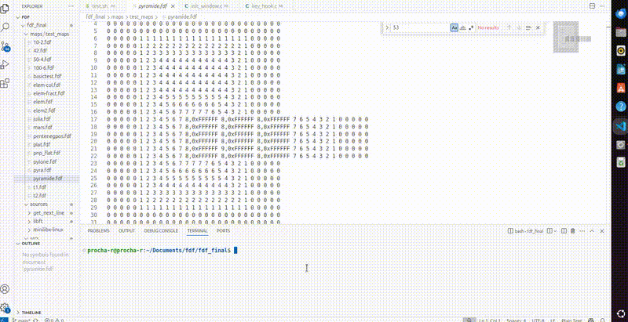

# **FdF — Wireframe Map Renderer** 🗺️🧱✨



> A clean, **Norminette-compliant** MiniLibX project that parses heightmaps and renders gorgeous wireframes with isometric/parallel projection — fast, stable, and defense-ready.

---

## **Table of Contents** 📚

- [[#Technological Overview 🛠️|Technological Overview 🛠️]]
- [[#Design Goals & 42 Norms 🎯|Design Goals & 42 Norms 🎯]]
- [[#Project Structure 📂|Project Structure 📂]]
- [[#Key Modules & APIs 🧩|Key Modules & APIs 🧩]]
- [[#Build & Run 🏗️▶️|Build & Run 🏗️▶️]]
- [[#Controls ⌨️🖱️|Controls ⌨️🖱️]]
- [[#Map Format 🧾|Map Format 🧾]]
- [[#Rendering Pipeline 🚦|Rendering Pipeline 🚦]]
- [[#Error Handling & Edge Cases 🚑|Error Handling & Edge Cases 🚑]]
- [[#Performance Notes ⚡|Performance Notes ⚡]]
- [[#Defense Checklist (42) 🛡️|Defense Checklist (42) 🛡️]]    
- [[#Roadmap 🗺️|Roadmap 🗺️]]
- [[#Screenshots GIF Placeholders 📸🎥|Screenshots & GIF Placeholders 📸🎥]]
    

---

```ad-info
title: Status
All source files pass **Norminette** ✅  
Core modules compile and run on **Linux** with **MiniLibX** (X11).  
Rendering supports **Isometric** and **Parallel** projections.
```

```ad-warning
title: 42 Norms Snapshot
- No `for` loops (⚠️ *use `while` only*).  
- No function declaration **and** assignment on the same line.  
- Strict header guards + includes.  
- Split responsibilities across modules (no monolithic files).
```

---

# **Technological Overview** 🛠️

- **Language:** C (ISO C99-friendly within 42 constraints)    
- **Graphics:** MiniLibX (X11) → `-lmlx -lXext -lX11`
- **Math:** Lightweight transforms (rotation, scaling, translation)
- **Parsing:** Robust input reader with `get_next_line` and extended `libft`
- **Architecture:** Clear separation — **map** (I/O & validation), **project** (projections), **draw** (pixels/lines/wireframe), **events** (hooks), **utils** (error, free, checks)
    

---

# **Design Goals & 42 Norms** 🎯

- ✅ **Norminette clean** (all the proprietary code pass strict code style norm eval! The ones provided by MiniLibX are expected not to.)
- ✅ **Deterministic rendering** (Bresenham, integer-friendly state)
- ✅ **Safe memory model** (centralized free paths, no leaks)
- ✅ **Predictable input parsing** (strict validation, helpful errors)
- ✅ **Separation of concerns** (headers per domain, tiny C units)
    

> Project passes with **OK!** for all expected files from `norminette`

---

# **Project Structure** 📂

```
includes/
  draw.h           # line/pixel API, Bresenham args, wireframe entry
  events.h         # hooks: keys, mouse, exit, setup
  fdf.h            # core types (t_map, t_mlx, t_fdf, projections enum)
  map.h            # map parsing/validation utils, point parsing, ctx
  project.h        # projections (isometric, parallel, conic optional)
  utils.h          # checks, error_exit, free_map/all, ext-libft helpers

sources/
  minilibx-linux/  # mlx headers (X11)
  libft/           # extended libft (headers shown)
  get_next_line/   # GNL headers (BUFFER_SIZE=1024)

<your .c files grouped by domain>:
  init_window.c
  events/...
  draw/...
  map/...
  utils/...
  bonus/...
```

```ad-note
title: Headers Overview
- `fdf.h` → central types used across modules (don’t put logic here).  
- `map.h` → line counting, cols counting, `parse_point`, read+fill matrix.  
- `project.h` → projection transforms from `t_point3` → `t_point2`.  
- `draw.h` → **Bresenham**, `put_pixel`, `create_image`, `draw_wireframe`.  
- `events.h` → loop, key/mouse, window close handlers.  
- `utils.h` → error paths, arg checks, extended `libft`.
```

---

# **Key Modules & APIs** 🧩

## **Core Types** (from [[#includes/fdf.h|`fdf.h`]]) 🧱

- `t_point3 { float x, y, z; }` → input vertex (map-space)
- `t_point2 { float x, y; }` → output pixel (screen-space)
- `t_map { int width, height, **matrix, z_min, z_max; }`
- `t_mlx { mlx_ptr, win_ptr, img_ptr, addr, bpp, line_len, endian, win_w/h, zoom, offset_x/y, angle_x/y }`
- `t_fdf { t_map map; t_mlx mlx; t_projection projection; }`
    

## **Projections** (from [[#includes/project.h|`project.h`]]) 🧭

- `project_iso(p, map, mlx)` → isometric (default)
- `project_parallel(p, map, mlx)` → orthographic/parallel
- `project_conic(p, map, mlx)` → (bonus) configurable perspective
## **Drawing** (from [[#includes/draw.h|`draw.h`]]) 🎨

- `put_pixel(mlx, x, y, color)`
- `draw_line(mlx, start, end, color)` → **Bresenham** via `t_bresenham`
- `draw_wireframe(map, mlx, projection)` → iterates grid, draws edges
- `create_image / clear_image / render_image` → double-buffered feel
## **Events** (from [[#includes/events.h|`events.h`]]) ⌨️🖱️

- `setup_hooks(fdf*)` → binds key/mouse/exit/loop callbacks
- `key_hook`, `mouse_hook`, `close_window` → dispatch user intent
## **Map Parsing** (from [[#includes/map.h|`map.h`]]) 🧾

- `parse_map(file, map)` → validates, counts lines/cols, allocates matrix
- `validate_line`, `count_columns` → strict format guardrails
- `parse_point(token, &z, &color, default)` → supports `z` and `z,0xRRGGBB`
- `update_min_max_z`, `get_z_min/max` → dynamic color/scale hints

## **Utils** (from [[#includes/utils.h|`utils.h`]]) 🧰

- `check_args`, `is_numeric`, `init_window(mlx, w, h, title)`
- `error_exit("message")`
- `free_map(map)`, `free_all(map, mlx)`
    
- Extended libft: `ft_atol`, `ft_split`, `ft_free_split`, `ft_strchr`, …
    

---

# **Build & Run** 🏗️▶️

```ad-tip
title: Dependencies (Linux/X11)
- `sudo apt-get install build-essential xorg libxext-dev libx11-dev`
- Link flags: `-lmlx -lXext -lX11 -lm`
```

### **Compile (example gcc call)**

```bash
gcc -Wall -Wextra -Werror \
  -Iincludes -Isources/minilibx-linux -Isources/libft -Isources/get_next_line \
  sources/**/*.c \
  -L. -Lsources/minilibx-linux \
  -lmlx -lXext -lX11 -lm \
  -o fdf
```

> Prefer a `Makefile` with targets: `all`, `clean`, `fclean`, `re`, `bonus`.  
> Keep objects per module folder (clean, readable build logs).

### **Run**

```bash
./fdf maps/42.fdf
```

---

# **Controls** ⌨️🖱️

- **Arrows / WASD** → Pan (offset X/Y)
    
- **`+` / `-`** → Zoom in/out
- **`Q` / `E`** → Rotate `angle_x`
- **`A` / `D`** → Rotate `angle_y`
- **`1`** → Parallel projection
- **`2`** → Isometric projection
- **`ESC` / Window close (X)** → Exit & free all

_(Bind these in `key_hook.c` / `mouse_hook.c` as you already do.)_

---

# **Map Format** 🧾

- **Rows = Y**, **Columns = X**    
- Token forms:
    - `z` (e.g., `3`)
    - `z,color` (e.g., `3,0xFF8800`)
- Example:
    
    ```
    0 0 0 0
    0 1 1 0
    0 2,0xFF0000 2,0x00FF00 0
    0 1 1 0
    0 0 0 0
    ```
    

```ad-example
title: Color Inference
If no color is provided, you can interpolate a gradient using `z_min`/`z_max`.
```

---

# **Rendering Pipeline** 🚦

1. **Parse** file → `t_map.matrix[y][x] = z` (+ optional color)
2. **Configure** viewport → `zoom`, `offset_x/y`, `angle_x/y`, `win_w/h`
3. **Project** each map point (`t_point3`) → screen (`t_point2`)
4. **Draw** wires (grid neighbors) via **Bresenham** 
5. **Blit** image → window (`mlx_put_image_to_window`)
6. **React** to input via hooks → update state → redraw

```ad-note
title: Why Bresenham?
Integer/error-accumulation based incremental rasterization → fast, predictable, sharp lines.
```

---

# **Error Handling & Edge Cases** 🚑

- **Args / Usage**: `check_args` (argc/argv check, file readable?)
- **Map Validity**: `validate_line`, `count_columns` uniformity
- **Memory Safety**: `allocate_matrix` → on failure → `free_map` + `error_exit`
- **GNL Robustness**: handle last line without newline; ignore empty lines
- **Window/MLX**: on any MLX error → **clean close** (`mlx_destroy_*`)
- **Bounds**: clipping in `put_pixel` (discard outside viewport)
 

```ad-warning
title: Common Pitfalls
- Mixed column counts per row → **reject** with helpful error.  
- Color parsing (`0xRRGGBB`) → **strict hex**; default when invalid.  
- Tiny/huge maps → adapt `zoom` & `offset` (fit-to-window heuristic helps).
```

---

# **Performance Notes** ⚡

- **Single image buffer** (avoid `mlx_pixel_put` in hot loops).
- **Batched drawing** → draw then `mlx_put_image_to_window`.
- **Integer-heavy Bresenham** (no floats in inner loop)    
- **Reuse** projection intermediates if needed (micro-opt).
- **Avoid** redundant `strlen`/`atoi` in `parse_row_points` (cache tokens).

---

# **Defense Checklist (42)** 🛡️

- ✅ **Norminette**: _you have a full pass across files    
- ✅ **Headers**: clean guards, **no logic** in headers
- ✅ **No `for`** loops → only `while` (double-check!)
- ✅ **No decl + assign on same line** (42 style)
    
- ✅ **Separation**: `map/*`, `draw/*`, `events/*`, `utils/*`, `bonus/*`
    
- ✅ **Free paths**: `free_all` on all exits, no leaks
- ✅ **Conformant MLX usage**: init, image, data addr, put, destroy
- ✅ **Test cases**: small, big, with/without colors, invalid inputs
- ✅ **Explain**: Bresenham math; projection matrices; parsing decisions
 
```ad-question
title: Typical Evaluator Questions
- How do you prevent out-of-bounds writes when plotting pixels?  
- Why is Bresenham preferred over DDA here?  
- Show me where memory is freed when the user closes the window.  
- How do you handle malformed tokens like `2,0xZZZZZZ`?  
- What’s the difference between isometric and parallel projections in your math?
```

---

# **Roadmap** 🗺️

-  **Conic / perspective** projection toggle (bonus hook)
-  **Fit-to-window** auto-scaling on load
-  **Dynamic palette** based on `z` histogram
-  **Map loader UX** (drag-and-drop path, optional)
-  **GIF demos** & screenshots (see next section)

---

# **Screenshots & GIF Placeholders** 📸🎥

GIFs Coming soon..
---

> 🧭 **Quick Mental Model:** _Map → Parse → Matrix → Project → Draw → Present → Hook → Update → Redraw._  
> 
